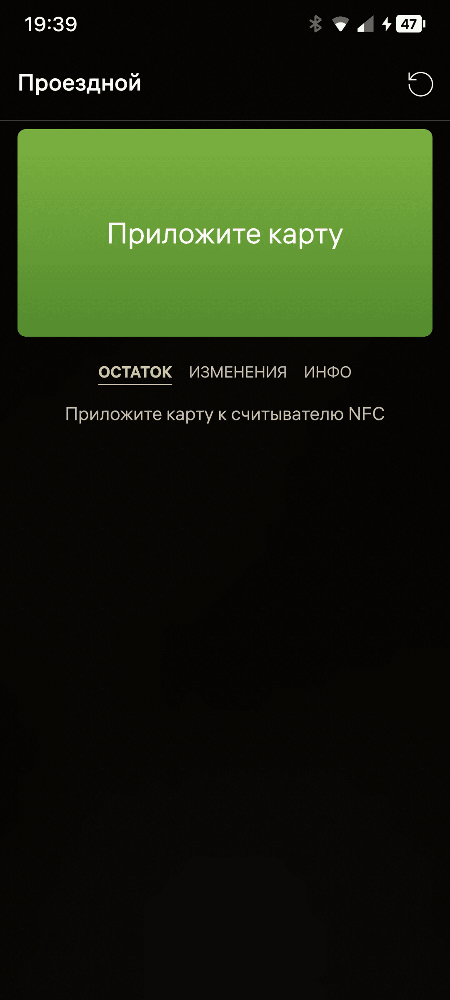
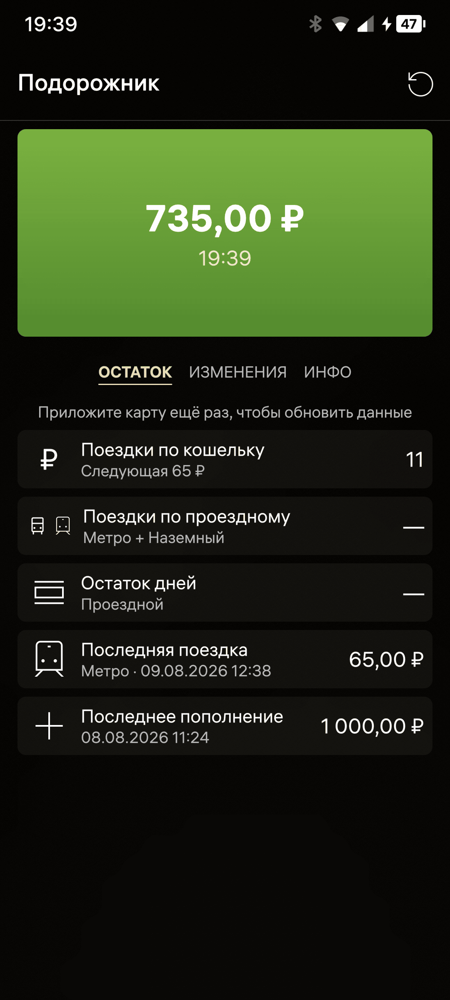
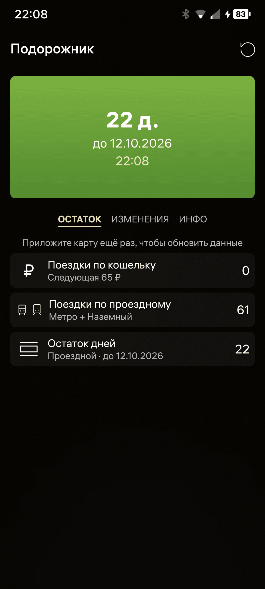
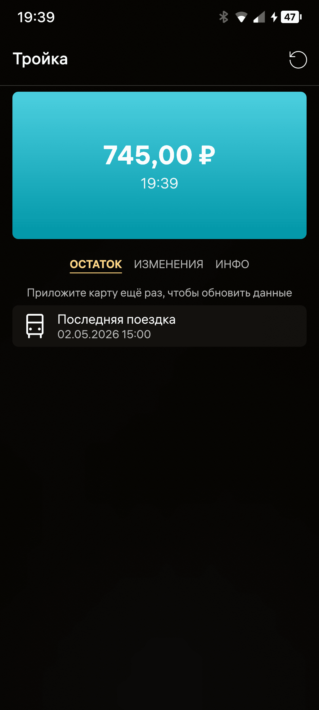
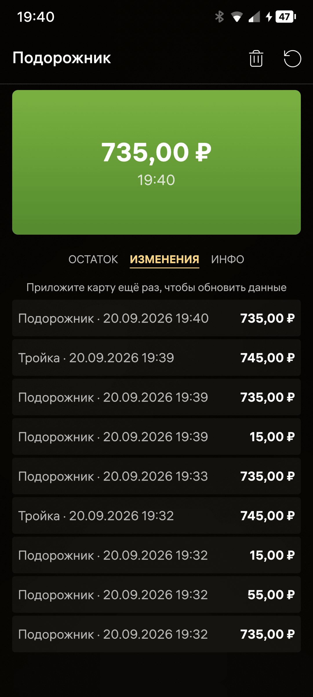
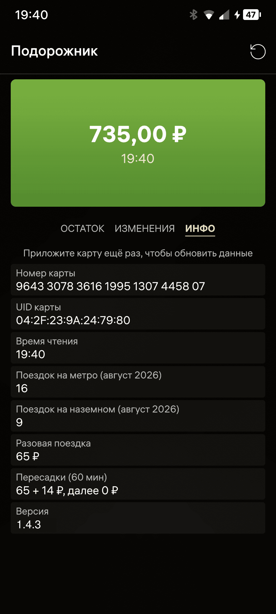
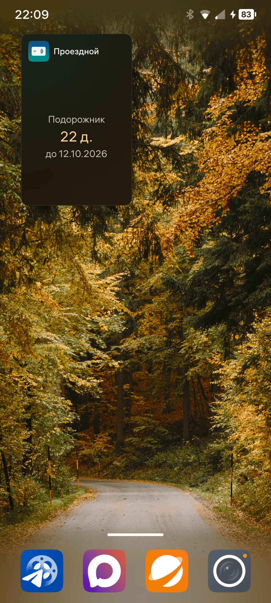

# Проездной — приложение для ОС Аврора

Приложение показывает баланс, данные о поездках и проездных, когда
транспортную карту прикладывают к телефону по NFC. Поддерживаются карты
«Подорожник» (Санкт-Петербург) и «Тройка» (Москва). Обе карты работают
по технологии MIFARE Classic (Crypto1); её поддержка в ОС Аврора
ограничена, поэтому вторым компонентом проекта ведётся доработка
NFC-стека (nfcd).

<p align="center">
  
  
  
  
  
  
  
</p>

## Структура репозитория

- `app/` — приложение для ОС Аврора (Qt5/QML, Silica),
  пакет `ru.nighteugene.MyTravelPass`.
- `nfcd-mifare-classic/` — поддержка MIFARE Classic в nfcd: патчи на
  `sailfishos/nfcd` и `mer-hybris/libnciplugin`, скрипт получения исходников,
  инструкция по сборке в Platform SDK.
- `scripts/aurora_mcp.py` — CLI-клиент MCP-сервера developer.auroraos.ru
  (поиск по документации и примерам кода), используется при разработке.
- `scripts/gen_icons.py` — генератор иконок приложения (без зависимостей).

## Как это работает

1. Приложение слушает системную шину D-Bus: `org.sailfishos.nfc.Adapter`
   (сигнал `TargetPresentChanged`, метод `GetTags`).
2. У найденной метки проверяет `org.sailfishos.nfc.Tag.GetType()`
   == `MIFARE_CLASSIC` (0x02).
3. Через `org.sailfishos.nfc.TagClassic.GetSerial()` получает UID и далее
   методом `Tag.Transceive()` отправляет команды проприетарного протокола
   контроллера (Crypto1 всегда выполняет чип; формат определяется перебором
   и кэшируется, см. `app/src/cardreader.cpp`):
   - NXP: `MfcAuthReq {0x40, сектор, тип ключа, ключ}` — авторизация,
     `{0x10, 0x30, блок}` — чтение блока (16 байт);
   - ST (как в AOSP `rw_mfc.c`, без CRC): `auth {0x60/0x61, блок, UID[4], ключ}`
     (успех = пустой ответ), `{0x30, блок}` — чтение (15 байт).
     Четыре байта UID в auth разнятся по стекам: ST21NFC ждёт последние
     4 байта UID, binder-HAL MediaTek — первые 4; перебираем оба варианта.
     `Tag.Acquire` не используется: на binder-HAL он выполняется «успешно»,
     но ломает весь последующий обмен (Transmission failed на любой кадр).
4. Тип карты определяется пробной авторизацией: сначала ключи
   «Подорожника» (сектор 4), затем ключ сектора 8 «Тройки»
   (`A73F5DC1D333`) с проверкой магии транспортной записи.
5. «Подорожник»: сектор 4, блок 16, байты 0–3 — баланс, uint32 LE,
   в копейках (ключ A `E56AC127DD45`, запасной ключ B `19FC84A3784B`).
   Печатный номер карты — из блока 0 (ключ по умолчанию `FFFFFFFFFFFF`):
   `«9643 3078 » + 7-байтовый LE номер + контрольная цифра Луна`.
   Сектора 5 и 8–12 — поездки, пополнение и билетная зона
   (см. `app/src/podorozhnik.cpp`).
6. «Тройка»: сектор 8, блоки 32–34 — 48-байтовая транспортная запись,
   поля адресуются битами (MSB first). Разбираются layout'ы кошелька
   E1/E3/E5: номер карты (биты 20–51), баланс, последняя поездка
   (см. `app/src/troika.cpp`). На ST-стеке блоки приходят урезанными
   до 15 байт — дополняются нулевым байтом, чтобы не съехали смещения.

Раскладка и ключи подтверждены независимыми открытыми источниками:
[metrodroid](https://github.com/metrodroid/metrodroid),
[Flipper Zero firmware](https://github.com/flipperdevices/flipperzero-firmware)
(`applications/main/nfc/plugins/supported_cards/plantain.c`, `troika.c`
и `api/mosgortrans/mosgortrans_util.c`),
[plantain_parser](https://github.com/rozetkinrobot/plantain_parser).

## Сборка и установка приложения

Сборка — через Aurora SDK (BT): `apptool` в Docker-образе Build Tools
(в этом образе Qt 5.6, учитывайте при написании кода):

```sh
cd app
docker run --rm -u $(id -u):$(id -g) -e HOME=/tmp -v "$PWD":/sources -w /sources \
    aurora-build-tools-<пользователь>:5.2.1.200 apptool build
# Пакеты (aarch64, armv7hl, x86_64), подписанные и проверенные rpm-validator'ом,
# появятся в app/RPMS/
```

Установка на устройство (не через `rpm -i` — Аврора ставит сторонние пакеты
только через APM; `sdk-deploy-rpm` — обёртка над ним, `--silent` — без
подтверждения). Переустановка той же версии при отладке работает; версию в
`rpm/*.spec` поднимайте для релизов и не забудьте строку версии на вкладке
ИНФО (`qml/pages/MainPage.qml`):

```sh
scp app/RPMS/ru.nighteugene.MyTravelPass-<версия>.aarch64.rpm defaultuser@<device>:/tmp/
ssh defaultuser@<device> 'sdk-deploy-rpm --silent /tmp/ru.nighteugene.MyTravelPass-<версия>.aarch64.rpm'
```

## Проверено на устройствах (сентябрь 2026)

**T800 (NXP PN7160, ОС Аврора 5.1.4) — работает.** Приложение читает
баланс обеих тестовых карт (MIFARE Classic 1K и 4K) со стандартными
ключами «Подорожника». Так как вендорский HAL отвергает MIFARE-кадры,
используется обходной путь из `nfcd-mifare-classic/`: nfcd работает через
pn54x-плагин напрямую с `/dev/nxpnfc`, чип конфигурирует `nci-init`
(aarch64) из systemd drop-in. См. `nfcd-mifare-classic/README.md`.

**Fplus MP-67A27 (MediaTek Helio G99, NFCC ST21NFC, Аврора 5.2) — тоже
работает**, причём на стоковом nfcd (компонент `nfcd-mifare-classic` не
нужен): ST лицензировала Crypto1 у NXP, его исполняет прошивка чипа.
Метка активируется с proprietary RF-интерфейсом ST `0x90`, кадры — в
формате AOSP `rw_mfc.c` (см. выше). Air-кадры с CRC_A стек ST молча
отвергает — поэтому первоначальный вывод «только UID» был ошибочным.

**Mashtab TrustPhone T1 (MediaTek, binder-HAL, Аврора 5.2.2) — работает**
на стоковом nfcd: Crypto1 исполняет вендорский HAL, кадры — в формате
AOSP `rw_mfc.c` с ПЕРВЫМИ 4 байтами UID в auth. Две особенности стека:
NXP-формат auth отвергается D-Bus-ошибкой (не пустым ответом, как у ST),
а `Tag.Acquire` ломает последующий обмен — поэтому приложение его не
использует.

**Aquarius AQ_NSM21 (binder-HAL, Аврора 5.2.1) — работает** на стоковом
nfcd, тот же binder-путь, что и у T1.

Итог: для чтения карт нужен NFC-контроллер с Crypto1 — NXP
(PN54x/PN71xx/SN1xx/SN2xx, плюс компонент `nfcd-mifare-classic`),
STMicroelectronics поколения ST21NFCD/ST54 (стоковый стек) либо
вендорский HAL с Crypto1 (MediaTek). Контроллеры без Crypto1 (Broadcom
и др.) читают только UID.


## MCP-сервер Авроры при разработке

Сервер `https://developer.auroraos.ru/api/mcp` (имя сервера — `dev-aurora`,
аутентификация не требуется) — официальный источник документации и примеров:

```sh
python3 scripts/aurora_mcp.py tools
python3 scripts/aurora_mcp.py call search '{"query":"nfcd Tag Transceive","index":"docs"}'
python3 scripts/aurora_mcp.py call get_document \
    '{"path":"doc/software_development/reference/communication/nfcd/tag","index":"docs"}'
```

## Лицензия

Код проекта — BSD-3-Clause (см. [LICENSE](LICENSE)). Патчи в
`nfcd-mifare-classic/patches/` — сторонние изменения из открытых pull request'ов
(см. `nfcd-mifare-classic/README.md`), на них действуют лицензии исходных проектов.
